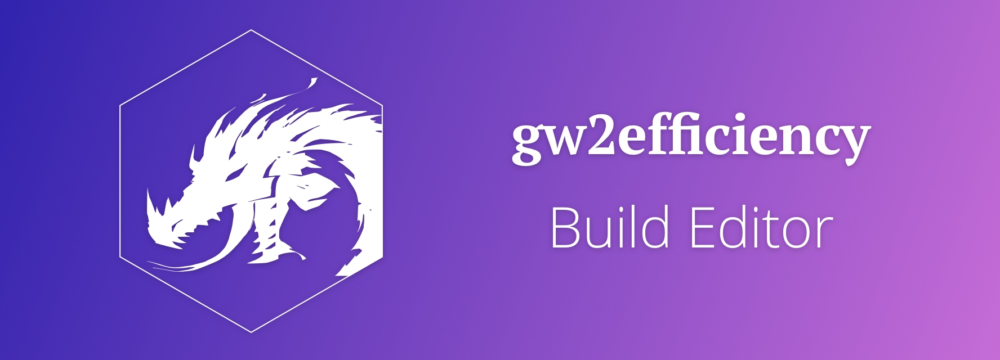

# 

The **gw2efficiency Build Editor** is a new online build editor for Guild Wars 2
using the official API to always have up-to-date skill, trait and gear data.

You can create a new issue to report a bug or request a new feature.

## Installation

1. Clone this repository.
2. Install all dependencies (`npm install`).
3. Run the development server with `npm run dev`.

## Contributing

Thank you for considering to contribute to the development of the build editor.

1. Fork this repository.
2. Install your fork locally (see [Installation](#Installation)).
3. Make your changes and commit them into a new branch. 
   Try to follow the style of the existing code as closely as possible.
4. Make sure linting and all existing tests pass with `npm test`.
5. Create a pull request (PR) to this repository.

Please create a new branch/PR for every feature you are working on.

## License

The **gw2efficiency Build Editor** is licensed under the [MIT License](LICENSE).
